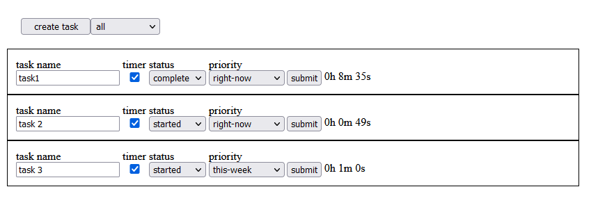

# Tempo
a simple task manager application to demonstrate minimal full stack 


---
## prerequisits
- [python](https://www.python.org/downloads/)
- [node](https://nodejs.org/en/download/)
#### for windows only
- [git/bash](https://git-scm.com/downloads)
---
## TO setup (windows git/bash terminal)
#### Note: for linux or mac users, directions might be slightly different like how to activate python virtual environment
1. clone directory
```
    cd <programs-directory>
    git clone https://github.com/michavardy/tempo.git
    cd tempo
```
2. download required node packages
```
    npm install
```
3. activate python virtual environment

```
    . tempo/Scripts/activate
```
4. pip install required python packages

```
    cd scripts
    pip install requirments.txt
```
5. make bash files executible

```
    chmode +x run_webServer.sh
    cd ..
    chmode +x run.sh
```
---
## To Run
```
    sh ./run.sh
```
---
## Project structure
```

|-- scripts
|   |-- __init__.py
|   |-- config.ini
|   |-- configuration.py
|   |-- main.py
|   |-- requirments.txt
|   |-- run_webServer.sh
|   `-- tdb.py
|-- src
|   |-- App.css
|   |-- App.jsx
|   |-- Task.css
|   |-- Task.jsx
|   `-- index.js
|-- public
|   `-- index.html
|-- db.json
|-- run.sh

```


